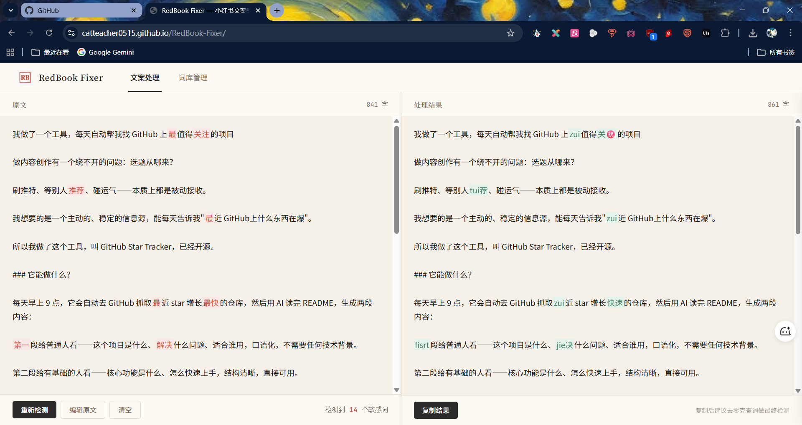
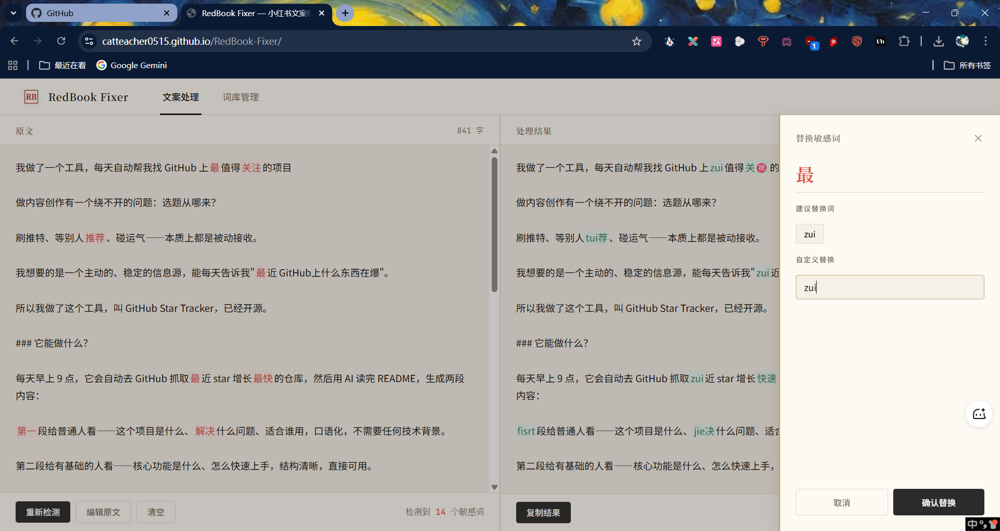
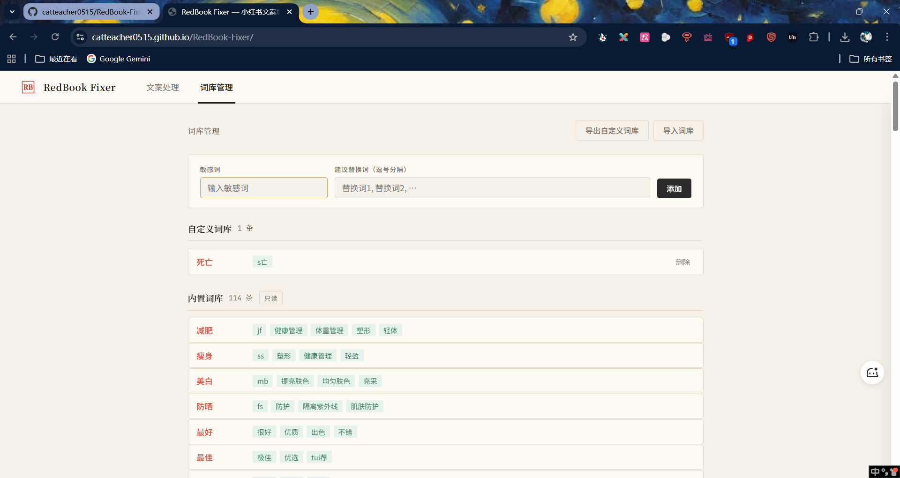

# RedBook Fixer

小红书文案敏感词预处理工具，帮你快速定位并替换文案中的敏感词，减少发布被限流的风险。

---

## 在线访问地址

🔗 https://catteacher0515.github.io/RedBook-Fixer

---

## 使用流程

### 第一步：粘贴文案

在左侧文本框粘贴你的小红书文案。



### 第二步：开始检测

点击「开始检测」，工具会自动扫描全文：

- 左侧：敏感词以**红色**高亮标注
- 右侧：自动生成替换版本，有默认替换词的直接替换（绿色标注），没有的保持红色提示手动处理

### 第三步：处理敏感词



**方式一：点击高亮词**
点击左侧任意红色词，弹出替换面板，可以从建议词中点选，也可以自己输入，确认后右侧实时更新。

**方式二：编辑原文**
点击「编辑原文」切回编辑模式，直接修改文案，改完再点「重新检测」。

### 第四步：复制结果

右侧内容处理满意后，点击「复制结果」，粘贴到小红书发布。

> **建议**：复制后去 [零克查词](https://www.lingke.pro/) 做最终复检，本工具定位为初筛，不保证 100% 覆盖所有平台敏感词。

---

## 词库管理



切换到「词库管理」页面可以：

- 查看全部内置词条
- 添加自己发现的敏感词和对应替换词
- 删除自定义词条
- 导出 / 导入自定义词库（JSON 格式）

自定义词条优先级高于内置词库，同一个词以自定义为准。

---

## 注意事项

- **本工具为初筛工具**，小红书敏感词库会持续更新，遇到漏检词请手动添加到自定义词库
- **不需要登录或联网**，所有数据保存在本地浏览器（localStorage），清除浏览器数据会丢失自定义词库，建议定期导出备份
- 目前不支持移动端

---

## 本地运行

```bash
# 需要通过本地服务器打开，不能直接双击 index.html
npx serve .
```

打开 `http://localhost:3000` 即可使用。也可以用 VS Code 的 Live Server 插件直接打开。
